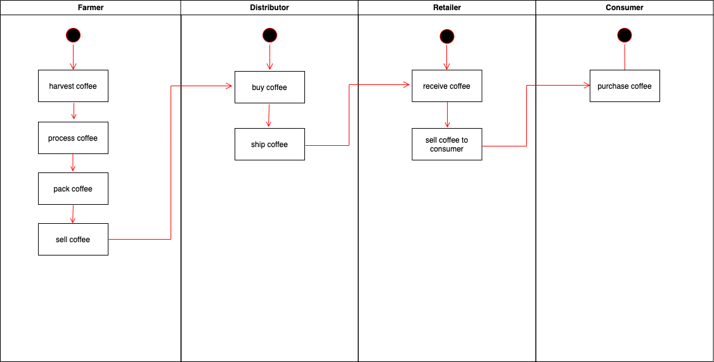
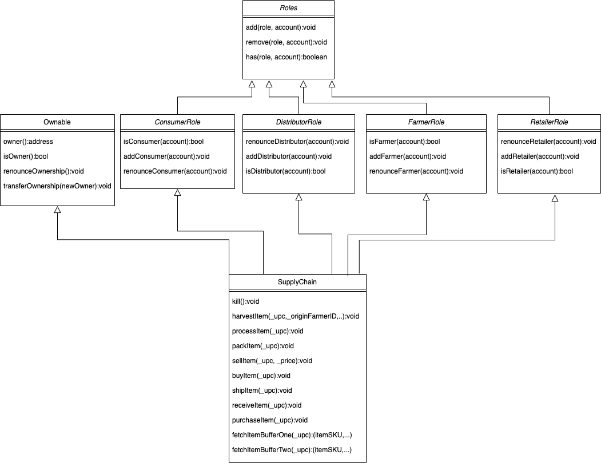
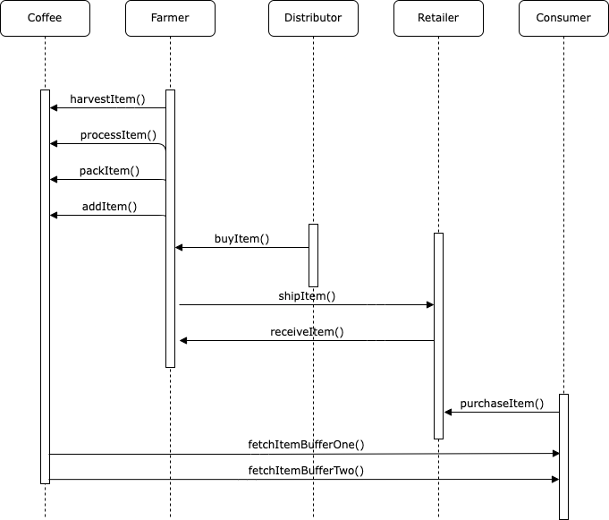
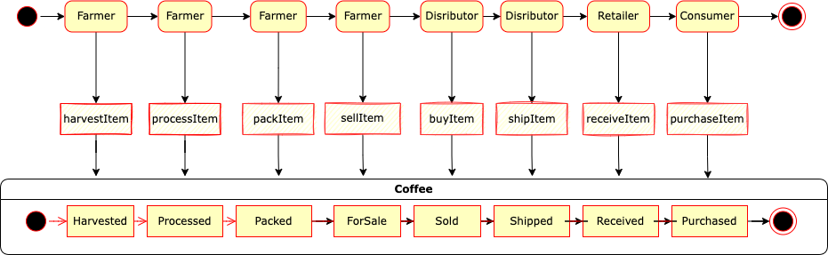

# udacity Blockchain Nanodegree Project 3

## Contract on Rinkeby

Supply-Chain Contract: [https://rinkeby.etherscan.io/address/0xea8d86647e088221df3c1d31daf511319af5722f](https://rinkeby.etherscan.io/address/0xea8d86647e088221df3c1d31daf511319af5722f)

```
  Deploying FarmerRole...
  ... 0xfb89afadfb2ab5db814498187841f54f7b970cddac48517a155046cd96cc4cc6
  FarmerRole: 0xd925f42461e0264158b5cd954174e15e4a1e3f25
  Deploying DistributorRole...
  ... 0x89d4e8f3c6e0ef2ddb79ce52278082751ef20b8aa958c9193a0c1fdb8ccaabbb
  DistributorRole: 0x9f3e38d92792ce1cfe20d9f4ceec4596f073362d
  Deploying RetailerRole...
  ... 0x2aeaf47c6ffc1da0c84be36fe926683544ef6e65c5e25ee1b2bc674854a38bd5
  RetailerRole: 0x41b732a5157de1b89b29fe112443876bc9bd8305
  Deploying ConsumerRole...
  ... 0x0cef2b28b265349a24108b0316b20dcdfe9599478ecceeab3d573dce2c02a850
  ConsumerRole: 0x915a49980e2ef2944ef86acb5bae4d77c4dcfe65
  Deploying SupplyChain...
  ... 0x22c8abb46f67254782102f9a8e11809b3d157d3b77a2d9e4b0faa1d94d8feb2a
  SupplyChain: 0xea8d86647e088221df3c1d31daf511319af5722f
Saving successful migration to network...
  ... 0xd79831d5670b060afdcf9313c08e7ed99f5597f87523647dd64d2bcbce93e8c0
Saving artifacts...
```

## Libraries used

- **truffle**: For easy management, testing & deployment of solidity code. Used in with `truffle-hdwallet-provider`.
- **mocha & chai**: Included in truffle for writing test with assertions on the desired output of the function.

## Used Versions

- truffle: 4.1.14
- Node.js: 17.9.0
- web3 Version: 1.7.1

## UML








